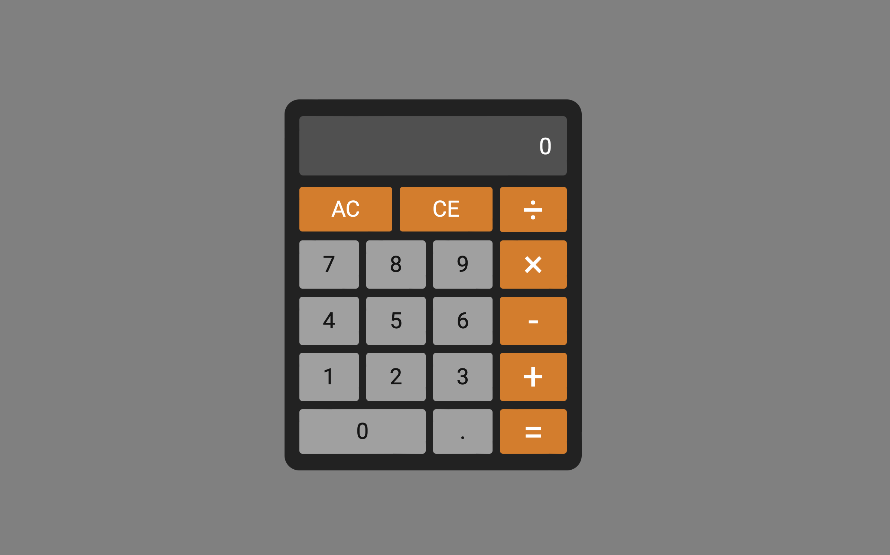
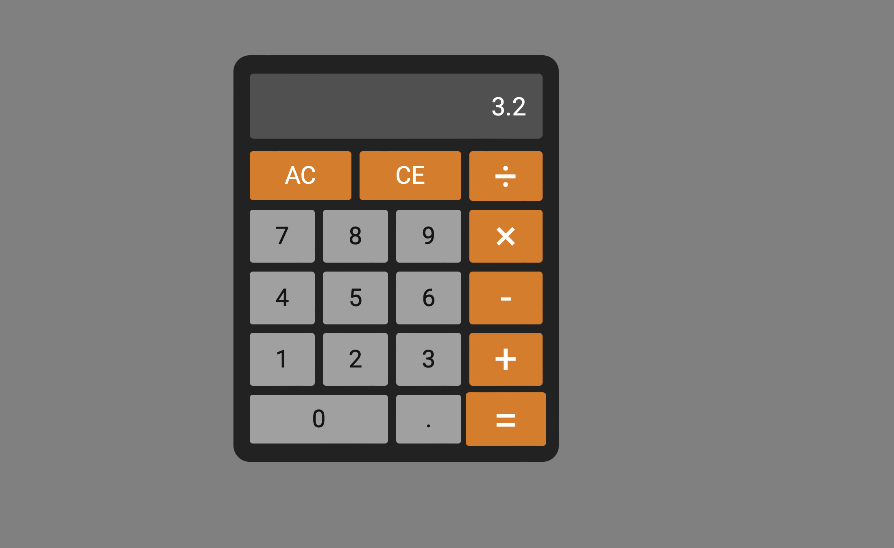

# Calculator

This was `Calculator`, the [*5th project*](https://www.theodinproject.com/lessons/foundations-calculator) within the Odin Project curriculum and the final one in Foundations. This was an assignment designed to consolidate students' knowledge and offer a finale to the Foundations course in an interesting manner.

## Links

- [*Live Preview*](https://devvivan.github.io/odin-calculator/)
- [*My Progress*](https://github.com/DevVivan/odin-project)

## What did this project teach me?
 
### JavaScript

- Functions and integrating them within the program
- Event Listeners & Event Handlers: `click`
- Conditional statements
    - If, Else if and Else statements

### HTML

- Implementing Favicons using `<link rel="icon">`
- HTML structuring using `
`

### CSS

- Importing external fonts
- Pseudo-classes: `:hover`

### Other

- Code optimization

## Images

